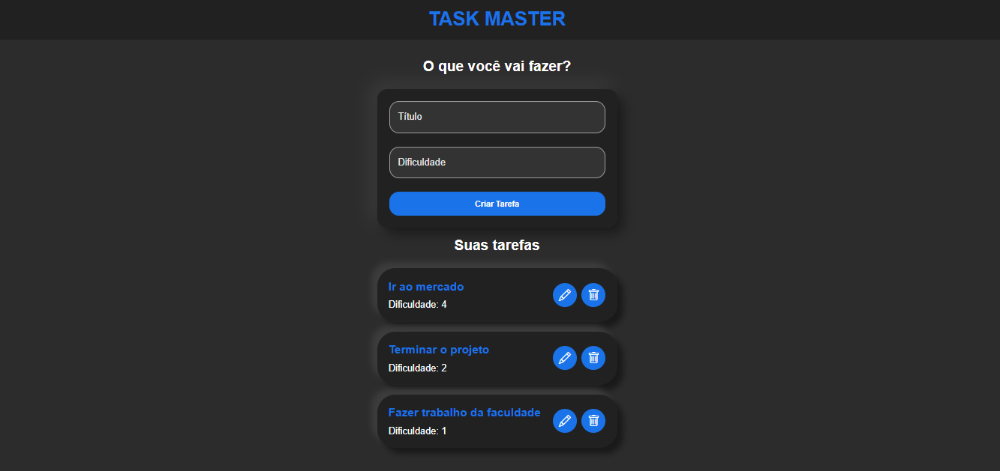

# TaskMaster

**TaskMaster** é projeto de uma lista de tarefas simples, desenvolvida utilizando React e TypeScript.



## 🚀 Funcionalidades

- **Adicionar tarefas:** Insira novas tarefas à lista com facilidade.
- **Editar tarefas:** Atualize os detalhes de uma tarefa existente.
- **Remover tarefas:** Delete tarefas quando concluídas ou não forem mais necessárias.
- **Definir nível de dificuldade:** Atribua um nível de dificuldade (em forma de número) para cada tarefa, ajudando na priorização das atividades.

## 🛠️ Tecnologias utilizadas

- **[React](https://reactjs.org/)** - Uma biblioteca JavaScript para construção de interfaces de usuário.
- **[TypeScript](https://www.typescriptlang.org/)** - Para garantir tipagem estática e maior segurança no desenvolvimento.
- **[CSS](https://www.w3schools.com/css/)** - Para estilização e layout da aplicação.

## 📋 Pré-requisitos

Antes de começar, verifique se você possui [Node.js](https://nodejs.org/) instalado em sua máquina.

## 🔧 Instalação

1. Clone o repositório para o seu ambiente local:
   ```bash
   git clone https://github.com/ErosNetto/TaskMaster.git
   ```
2. Navegue até o diretório do projeto:

   ```bash
   cd task_master
   ```

3. Instale as dependências:
   ```bash
   npm install
   ```
4. Inicie o servidor de desenvolvimento:
   ```bash
   npm run dev
   ```
5. Acesse o aplicativo no seu navegador.

## 📄 Licença

Este projeto está licenciado sob a licença MIT. Para mais detalhes, veja o arquivo [LICENSE.md](https://github.com/ErosNetto/TaskMaster/blob/main/LICENSE).
